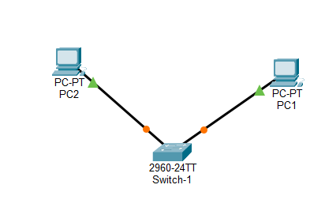
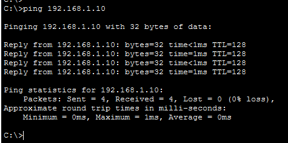

# 🌐 Lab réseau - Communication sur un réseau local

## 🎯 Objectif
Mettre en place une communication entre deux machines situées sur le même réseau local à l'aide d'un switch.

---

## 🧱 Topologie réseau

- 2 PC (clients)
- 1 switch

---

## 🌐 Configuration IP

- PC-Client-1 : 192.168.1.10 /24
- PC-Client-2 : 192.168.1.20 /24

---

## ⚙️ Configuration

Les deux machines sont connectées au switch avec des câbles Ethernet (straight-through) et configurées dans le même réseau IP.

---

## 🧪 Test de connectivité

Test réalisé avec la commande ping entre les deux machines.

---

## 📈 Résultat

La communication entre les deux machines est fonctionnelle.

---

## 🧠 Compétences développées

- Configuration d’adresses IP (IPv4)
- Compréhension du réseau local
- Utilisation d’un switch
- Test de connectivité avec ping

---

## 📁 Fichiers

- lab-reseau-switch-communication.pkt
- topologie-reseau-local.png
- test-ping-reseau-local.png
